El funcionamiento de un proveedor de identidad dentro de un IAM, se puede
describir como se indica en el siguiente diagrama de secuencia: 

```mermaid
sequenceDiagram
    autonumber
    participant App as 💻 App
    participant IAM as 🔐 IAM
    participant IP as 🪪 Identity Provider
    participant API as 📦 Resource Owner

    Note over App,IP: Fase de Dialogo
    App->>+IAM: Solicita una validación de identidad
    IAM->>+IP: Inicia llamada de validación

    IP->>+IP: Validación interna
    Note over App,IP: Fase de Respuesta

    alt
        rect rgb(0, 255, 0, 0.2)
          Note left of IP: Respuesta Exitosa
          IP->>IAM: Devolución de identidad propietaria
          IAM->>+IAM: Homologación de datos y firmado (RSA)
          IAM->>App: Callback URI con <br/> token de acceso de la identidad
          App->>App: Validación y<br/> Almacenamiento local
          App-->>API: Solicita acceso a un recurso (Endpoint, Server, File, etc)
          API-->>App: Valida el token de Acceso (JWT) y autoriza el acceso al recurso si corresponde
        end

    else
        rect rgb(255, 0, 0, 0.6)
          Note left of IP: Respuesta Erronéa
          IP->>IAM: Respuesta con código del error
          IAM->>App: Callback URI con código de error
        end
    end
```




donde: 

- **`💻 App`**: Es el sistema que interactua con IAM y quien da inicio al proceso de validación y acceso de acuerdo a algun caso de uso implementado que requiera acceder a un recurso restringido.

- **`🔐 IAM`**: Producto IAM que provee de validación de identidad y gestión de accesos de forma orquestada y unificada.

- **`🪪 Identity Provider`**: Proveedor de identidad que almacena la identidad que necesitamos validar de acuerdo a un modelo federado donde a través de un proceso probatorio propietario nos indicará si la entidad es válida o no en sus almacen de identidades.

- **`📦 Resource Owner`**: Almacén o API que contiene un recurso (archivo, endpoint, etc) que este restringido y limitado a cierto nivel de acceso y alcance.

<br />
Una vez entendido cada actor en el diagrama previo, nos falta entender la secuencia de flujo que explica el funcionamiento de un proveedor de identidad, la cual la explicaremos a continuación de acuerdo al numero asignado en cada paso de la secuencia:

- `1`: El aplicativo necesita acceder a un recurso restringido y por ello inicia la fase de dialogo donde, le indica al IAM que debe validar una identidad a acuerdo a algun [proveedor de identidad disponible](./available-providers/) en IAM.

- `2`: Una vez esta solicitud llega al IAM , este inicia una llamada de dialogo al proveedor de identidad solicitado con toda la información requerida por este, para iniciar un flujo web del proceso probatorio de la identidad. <br/>
*Comunmente este paso es un **redirect a una url indicada por el  proveedor de identidad** en su sección de integración y que previamente IAM ya tiene configurada internamente.*

- `3`: Este paso ocurre completamente del lado del proveedor de indentidad e IAM no puede modificar o alterar este proceso, debido a que ocurre completamente en el lado de proveedor de identidad.

- `4`: Si la validación fue procesada **exitosamente** y el proveedor de identidad indica que la **identidad es valida**, entonces esta misma, nos enviará de acuerdo a su configuración una llamada indicandonos el exito en conjunto con la información de la identidad que se encuentra en su almacen digital.

- `5`: Una vez el proveedor de identidad nos indica del exito a través de su proceso propietario, nosotros como IAM, verificamos que la información es confiable y que contiene la información minima necesaria para comenzar con el proceso de firmado de la identidad a través de un [token de acceso](https://en.wikipedia.org/wiki/Access_token) en formato [Json Web Token](https://en.wikipedia.org/wiki/JSON_Web_Token). <br/>
Con esto logramos la independencia del proveedor de identidad seleccionado ya que siempre homologamos a un token de acceso seguro y único (*firmado con nuestra llave RSA privada*) para que las aplicaciones que interactúen con nosotros confien en nuestra información y no tengan multiples llaves ni mecanismos de validación de identidad, ya que nosotros nos aseguramos del proceso probatorio de las identidades y proveedores que almacenen a estas.

- `6`: En este punto del proceso ya tenemos la validación de la identidad y tambien la información contenida en ella ha sido agregada en conjunto con los [roles y alcances](./index.md) asociados, por lo que es momento de enviar esto al aplicativo que necesita nuestro token con la identidad de acuerdo a la [configuración establecida](./index.md#fase-de-respuesta) en la fase de respuesta.

- `7`: Ahora que el aplicativo ya extrajo el [Token de acceso](https://en.wikipedia.org/wiki/Access_token), es momento de guardarlo en algún almacen local (*token efimero*) para agregarlo a cada petición en los parametros de cabecera bajo el esquema OAuth 2.0: <br /> 

```bash
curl --request GET \
  --url <PRIVATE_RESOURCE_URL> \
  --header 'Authorization: bearer <ACCESS_TOKEN>' \
  --header 'Content-Type: application/json' 
```
- `8`: Ya el sistema se encuentra listo para iniciar la solicitud a recursos restringidos en los cuales el token de acceso dará autorización, por lo cual ya podemos comenzar a ejecutar llamadas al [propietario del recurso](https://www.oauth.com/oauth2-servers/the-resource-server/).

- `9`: El propietario del recurso restringido, extrae el token de acceso de la cabecera y lo valida contra la llave RSA publica entregada por IAM para validar que el origen es confiable e inicia el proceso de decodificación del token y validación de acceso... si todo marcha bien , entonces el propietario del recurso autoriza el acceso y disponibiliza el recurso al aplicativo.

- `10`: En el caso de excepción donde el proveedor de identidad nos indique que hubo algun tipo de error para validar la identidad en sus sistema, este nos avisa a través de su proceso propietario.

- `11`: Ya con el código de excepción especifico del proveedor de identidad,  nosotros homologamos este error especifico del proveedor a uno común para facilitar su comprensión y lo enviamos a través de la [configuración establecida](./index.md#fase-de-respuesta) en la fase de respuesta al aplicativo que haya solicitado una validación de identidad.

---

Con esta explicación esperamos puedas entender como funciona un proveedor de identidad dentro de un contexto de IAM, y comó orquestamos el proceso de validación de identidad a través de los distintos proveedores disponibles.

`En palabras técnicas`: Un IAM es un orquestador que nos permite entre muchos otros beneficios, unificar el proceso de validación y gestión de accesos para lograr una experiencia de integración simple y sin fricción con el fin de acelerar el desarrollo de nuestros productos digitales y mantenerlos seguros y confiables hacia nuestros clientes, colaboradores y proveedores.

Si con esto... **aún no te motivas a sientes que deberias usar este increible producto 🥹**, entonces te invitamos a ingresar a ⛩ [nuestra aldea](./../how-to-contribute/) para que juntos podamos encontrar la mejor decisión de como asegurar tus productos digitales de una forma segura y confiable 🥷.

Happy Coding!.


