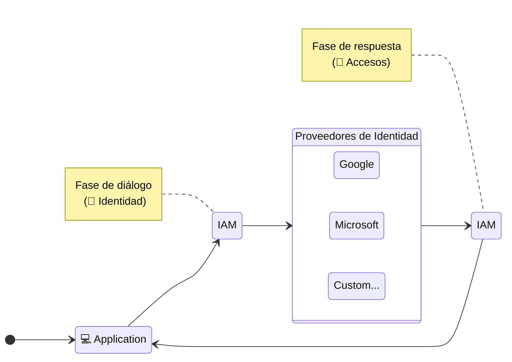

En un **Sistema de Gestión de identidad y accesos** conviven al menos dos partes, por un lado la validación de identidad (*Validar que yo sea yo*) y la gestión de accesos.

En este apartado nos enfocaremos en la **gestión de identidad** y sus conceptos.


## ¿Comó opera un proveedor de identidad?

Un proveedor de identidad en su forma mas simple, es un autorizador o entidad certiticadora (**issuer**) que se encarga de validar una identidad por medio de un sistema de autenticación propietaria, y basicamente nos asegura que la identidad a validar existe o no existe en sus sistema de acuerdo a una serie de procesos probatorios establecidos por ellos.

Algunos ejemplos de provedores de autenticación populares son:

- [Facebook](https://developers.facebook.com/products/facebook-login/): Permite identificarse con una cuenta social de meta (facebook , instagram , etc).
- [Microsoft](https://learn.microsoft.com/en-us/azure/active-directory/develop/single-sign-on-saml-protocol): Nos permite identificarnos con nuestra cuenta corporativa de red o a través de nuestro email corporativo.
- [Google](https://developers.google.com/identity/gsi/web/guides/overview?hl=es-419): Proveedor de autenticación social de google.

## Flujo dentro de un contexto de IAM

Para que un proveedor de identidad opere dentro de un IAM , es necesario que este responda al menos a dos solicitudes importantes descritas en el siguiente diagrama:



### Fase de Diálogo
Solicitud inicial donde se invoca al proveedor de identidad para iniciar un dialogo web donde se presentara el sistema de autenticación propietaria que guiara a la **identidad a comprobar como valida** por el procesos de validación que asegure que la identidad existe y es valida en sus sistemas.

:::note
El proceso de validación de identidad ocurre internamente a través del proveedor de autenticación y no es de alcance del IAM interrumpir o modificar de forma parcial o total algun punto del proceso.
:::

### Fase de Respuesta

En esta fase, es en donde se intercambia la información de exito o error del proveedor, acompañado con la información de la identidad y algún secreto o estado de intercambio que nos permita validar que la respuesta es valida y viene del origen correcto.

En esta fase , la recomendación por lo general en protocolos como [OAuth 2.0](https://oauth.net/2/) , es utilizar [URI fragment](https://en.wikipedia.org/wiki/URI_fragment) para obtener la información de identidad que se utilizara para producir un [token JWT](https://es.wikipedia.org/wiki/JSON_Web_Token) que identifique a la identidad de forma única.

Una **URL exitosa** de ejemplo sobre lo anterior puede ser: 
```uri
https://callback.cencox.yz/#access_token=[ACCESS_TOKEN]&state=[STATE]
```

donde:
- `https://callback.cencox.yz/` es la dirección url de redirección (*comunmente agregada en la configuración requerida por el proveedor de identidad*).

- `#access_token=[ACCESS_TOKEN]` es el token de acceso entregado por el proveedor de identidad  con la información segura de intercambio dispuesta por el proveedor de identidad.

- `state=[STATE]` es una variable de intercambio que se envia en la fase de dialogo y es devuelta en cada en cada solicitud posterior a ella.

<br />

Mientras que por el contrario una  **URL fallida** de ejemplo uede ser: 

```uri
https://callback.cencox.yz/#code=[CODE]&state=[STATE]
```

donde:
- `https://callback.cencox.yz/` es la dirección url de redirección (*comunmente agregada en la configuración requerida por el proveedor de identidad*).

- `#code=[CODE]` es un codigo de error que identifica de forma única el tipo de error que ocurrio en el proceso de validación de identidad.

- `state=[STATE]` es una variable de intercambio que se envia en la fase de dialogo y es devuelta en cada en cada solicitud posterior a ella.


::::info
la variable `state` en los parametros **URI** se usa comunmente para evitar [ataques de manipulación](https://owasp.org/www-community/attacks/Web_Parameter_Tampering) ya que se envia desde la primera llamada (fase de dialogo) y es devuelta en cada solicitud posterior a ella.

Comunmente esta variable contiene datos que identifiquen la sesión de forma única junto con algun mecanismo que asegure la `no manipulación` de los datos (*generalmente se crea un objeto y se firma con una llave secreta o certificado que es solo de conocimiento del sistema integrador y no es enviada al proveedor de identidad*)
::::